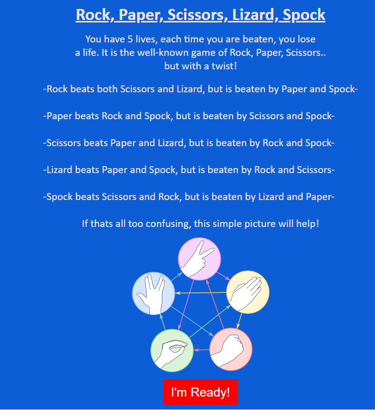
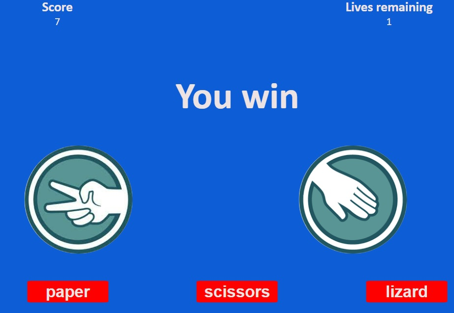
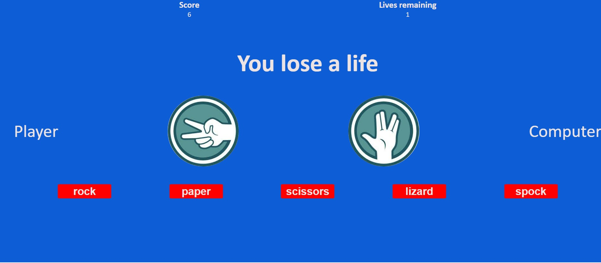
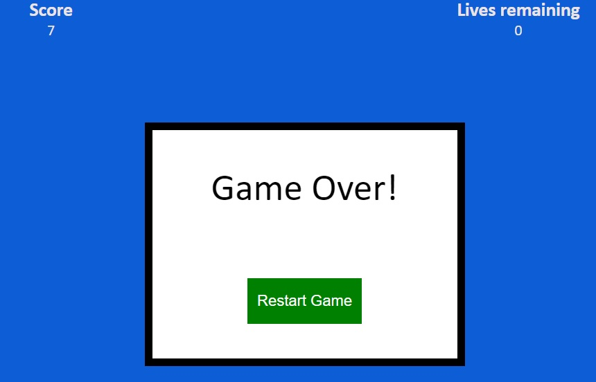
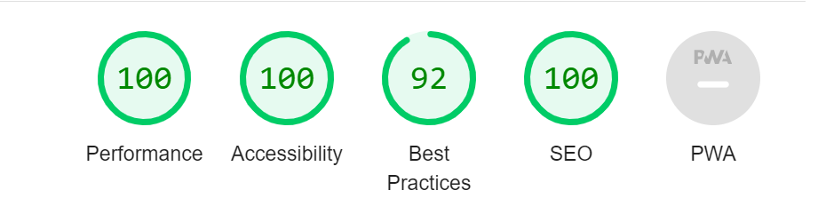

# Rock, Paper, Scissors, Lizard, Spock

RPSLS is a game of chance, where the user will choose a selection and have a 2/5 chance to win, 2/5 chance to lose and 1/5 chance to tie, all based on random number generated selections from the computer. The user is first given an in-sight on the rules of the game,
with a picture to help understand them. Then they are met with a "let's play button". After clicking the button they are faced with the game, a simple UI which displays the player choice, computer choice, score, lives remaining, options they can select and the result of the last game. Once all lives are deplated, the user is met with a game over pop up, which will give the option to restart the game. During gameplay the user can see the rules again and switch between the rules and the game.
The entire game is defined within a single function called 'game'.

## PAGE
- The page is displayed on a blue background with mostly white text, and is viewed in Calibri. This is all text for the page to be displayed with this font.

## NAVIGATION

- The Navigation bar is displayed at the top of the screen, it only gives the player two options as there are only two relevant options for the user to choose, 'rules' and 'game'.
- Clicking the 'rules' button will hide the current display (if not already on the rules section) and then display the rules, with a smooth transition time to add aesthetic.
- Clicking the 'game' button will hide the current display (if not already on the game section) and then display the rules, with a smooth transition time to add aesthetic.
- Once rendered in a different size, the logo and the text will auto shrink in size to fit nicely for the user aesthetic.
- When the user hovers over any of the links, the cursor will change to a pointer, promting the user that the links are clickable.
- The color scheme for the clickable buttons at the top of the screen matches the footer of the page.
- These two buttons act as event listeners, which when clicked add/remove opacity and cursor events.
- If a player clicks one of these after the game has ended, there is an 'if' loop that will prevent the game from bugging.

## SCORE SECTION

- This is displayed at the top of the screen, split evenly across the screen and will render smaller or larger depending on the size of the device it is being displayed on.
- The 'score' section starts at '0' and every time a player wins the score increases, this is done by using incrementation on the integer(++).
- The 'lives' section starts at '5'and every time a player loses the lives decrease, this is done by using decrementation on the integer(--).
- The lives section will increase with no limit until the 'lives' reach '0', then the game will end and the user will be faced with the Game over box.
- This section will be displayed no matter what section the user is currently on (i.e 'rules').

## RULES

- The rules section is shown to the player upon first loading the webpage, it displays the name of the game above the rules in a h2 header that is underlined.
- Under the heading, there is a brief description of the game and then simplified rules on how to play the game. This text is white to match the colour scheme of the website.
- This text will change size depending on the the viewport in which the page is displayed on.
- Under the rules there is an image, which will aid the user understand the rules, this image will change size depending on the rendered size of the page.
- Under the rules, there is a clickable button, which follows the same colour scheme as the other clickable buttons within the game. This button will remove the rules and load the actual game.
- This button was coded with 2 separate events, both with an event listener and a link. The event listener will listen for a click and then change the opacity/cursor events, similar to the nav bar.

## HEADING TEXT

- The heading text is displayed across the screen underneath the score section, this will tell the user if they win or if they lose.
- This text will render smaller or bigger depending on the size of the device it is being displayed on.
- This text is linked to an IF ELSE loop and using .textContent it will either display "Tie!", "You win" or "You lose a life" based on the player selection in relation to the computer selection.
- This text is white, which will match the rest of the text content.

## GAMEPLAY
 
- This is where the main game is played, across the centre of the screen where it will display the players current choice in an image and the computers choice in an image.
- The game is displayed underneath the header and score section and will render differently depending on the resolution size, either in a row or column and will change also change sizes.
- The images are linked to the clickable buttons and will listen for a click event, when this occurs, it will change according to the text selection that has been made.
- The 'computer' image will also change depending on what selection has been made, this is done by a random number generator using 'math.floor' & 'math.random' and multiplied by 5. This will then select an outcome from an array, which is linked to the text and will display the image based on the text.
- Underneath the images there are 5 selections, one for each 'rock','paper','scissors',lizard' & 'spock'. These are the selections the user can choose to play the game.
- Each button is confined within a function called decideWinner, which will take the value of the selection and the value of the computer selection and compare in an IF ELSE loop.
- If the user and the computer match, it will be ruled as a tie, and return. If the user and the computer do not match it will run an if else loop til the combination is found, and display the correct output based on what has been chosen (i.e if the player wins etc.)
- If it is not ruled as a tie, it will also either run playerScore++ which will add one to the score, or lives-- which will take one life away from the user. It will then call the scoreboard function to amend the interger accordingly. The function will then return for the next selection.
- The colour scheme for this matched the outlay of the rest of the page, using red coloured buttons with white text.
- The text content for the 'player' and 'computer' are also displayed in white to match the colour scheme for the rest of the website.
- When the user has lost, hte javascript listens for the '0' life count, which will trigger another style change, changing the opacity of the game and bringing up a game over box.

## GAME OVER

- As explained in the GAMEPLAY section, once the player loses all of their lives, they are met with a pop up in the center of the screen, with a different colour scheme to the rest of the text.
- It is a white square with a thick border, text that displays in black and states "game over". the only option a player can do here is restart the game, view the rules again or click to bring the game back upto the screen.
- The button is unique to the rest of the page in that it is green and has the text to restart the game.
- This button also has a click event where a function called reset is called, this will revert the lives to '5' and the score to '0' upon being clicked and will also fade away the game over screen using the same techniques as the other with opacity/pointer events.

## Footer

- This section is at the bottom of the page and remains at the bottom of the page when the user is nearer the top, this is so the footer does not cover any other content when viewing the page.
- the text for copyright and the 'text' colour used on the clickable social media icons, taken from FontAwesome and modified larger. When these links are clicked, they do not navigate the user away from the page, rather it opens a new tab with the _blank attribute.
-The links are that of my own and will take the user to my Github page/LinkedIn profile.

## Testing
- I tested this page across multiple devices and multiple browsers, The rendering of all elements was satisfactory upon multiple tests.
- I can confirm that the page rendered satisfactory across all devices.
- I can also confirm that all of the buttons worked across all devices, navigation took the users to the correct place and the game played as intended.
- I can confirm the game will reset upon being asked to.

## Key project goals
- The desired outcome of this project was to create a simple game of chance that will keep the user occupied for hours, if i had more time i would have liked to included 2 more difficulties, one easier with 2 less lives and one easier with 5 extra lives. I would have also liked to include a scoreboard that would allow recent players to see their most recent scores.

## Bugs
### In development, i encountered mutliple bugs and fixed almost all of them:
- The scoreboard would not work correctly, it would add multiple values to the score when only one outcome was selected, this was due to the function assuming the player had selected multiple choices for one click. I fixed this bug by creating an If selection for each and an if else selection for each, rather than just an IF/Else. This would also affect what text was displayed upon selecting and was fixed when the if else was changed.
- The game would not run entirely, this was fixed because the game() function was not being called.
- The images would not load correctly when selected, this was because the value attached did not match the selection. i fixed this by adding a decideWinner() function that called two arguments, this.textContent & computerPicks variables.
- When the User's game finishes and they are greeted with the game over screen, by clicking one of the rules or game section would not reset the lives/score and the counter would keep going on both into the minus for lives. This would bypass the resetting of the game, so i added the reset variables to both of these and once either of the two nav options are clicked, they will now reset the game.

### Some were not fixed, and rather i had a workaround for them:
- When rendered to different sizes, the page h2 will sometimes bug through the nav bar, i amended the different sizes based on width and height and tried to accomodate all of the sizes with extra padding so it does not do this.
- When displayed on certain viewport widths, the footer will have a gap, it is hard to determine whether this will truly occur as i have seen on two different devices the viewport for a certain device and both show differently.

## Validator testing
### HTML
- HTML passes the validation checks through the official W3C validator. There was only one warning that there was an empty H2 tag, which was intentional.
### CSS
- CSS passes the validation checks through the official Jigsaw validator.

### JavaScript
- Javascript passes the validation through the official Jshint website, the warnings only related to extensions.

## Accessibility
- The scores for lighthouse were as follows; they were very good. no major issues that weren't fixed.
 

## Deployment
- The site was deployed to Github pages, the steps were as follows;
- - In the github respository, above the files i clicked the settings icon, within this page there is a link to "pages" and from there i clicked the drop down menu and selected "main". After a refresh of the page, the link was available.
- - In the github respository, above the files i clicked the settings icon, within this page there is a link to "pages" and from there i clicked the drop down menu and selected "main". After a refresh of the page, the link was available.

The link for my page is here:

## Credits
- Re-used code from myself, the project beforehand. This was only basic code such as the FontAwesome script code.
- The images used for this project were taken from google including rock.jpg, lizard.jpg, scissors.jpg, paper.jpg & spock.jpg.
- The icons for my social media links were taken from FontAwesome.
- The image used in the rules section (RPSLS.jpg) was taken from PNG WING (https://www.pngwing.com/en/free-png-ycasl).
- I used various youtube videos for ideas and help with how to tackle certain issues during this project, however these were basic games of chance/other rock paper scissors games:
- - https://youtu.be/1yS-JV4fWqY
- - https://youtu.be/fIBOydve2f8
- - https://youtu.be/QQh8PNp8KcQ
